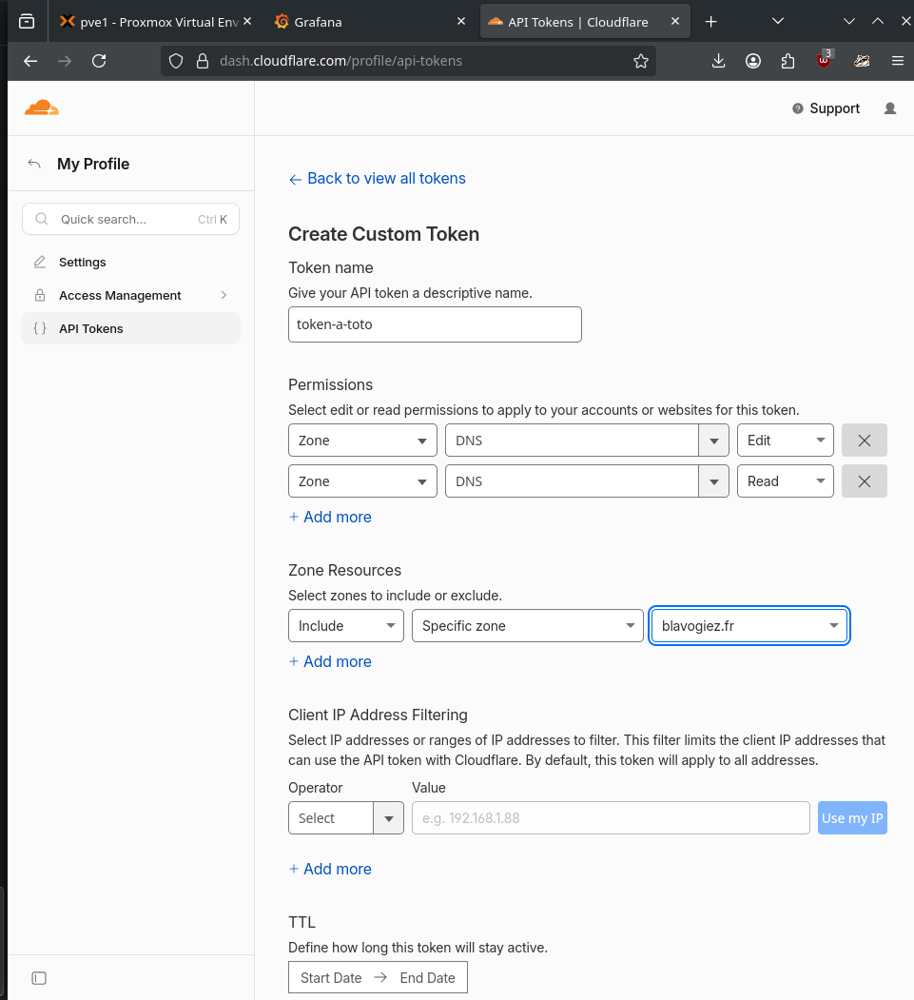
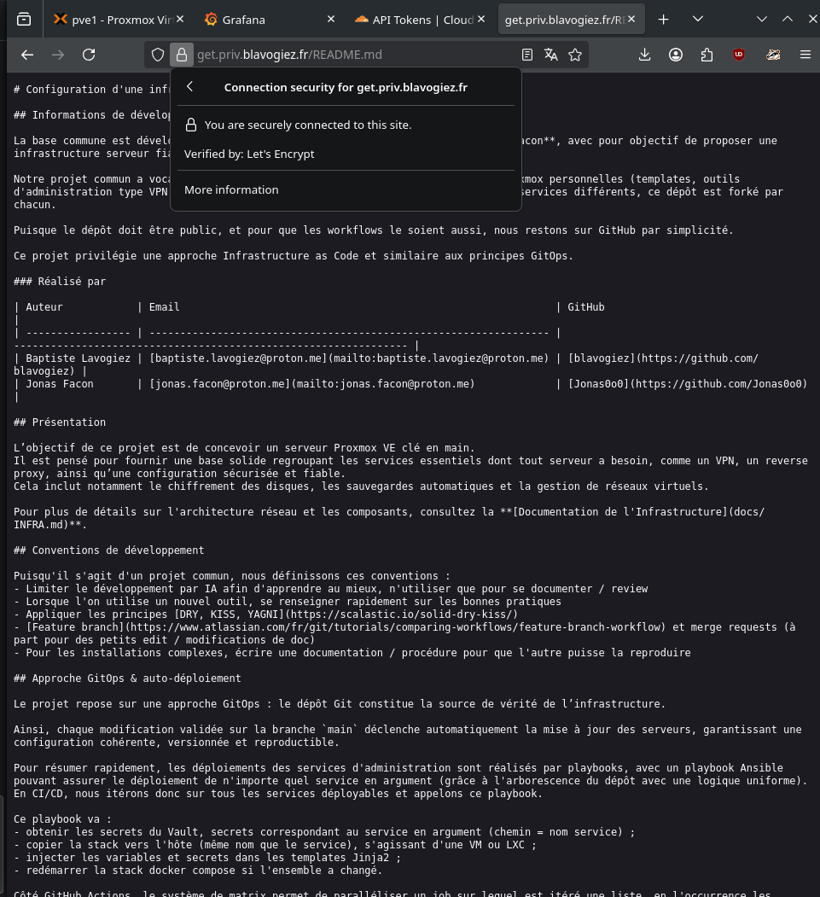
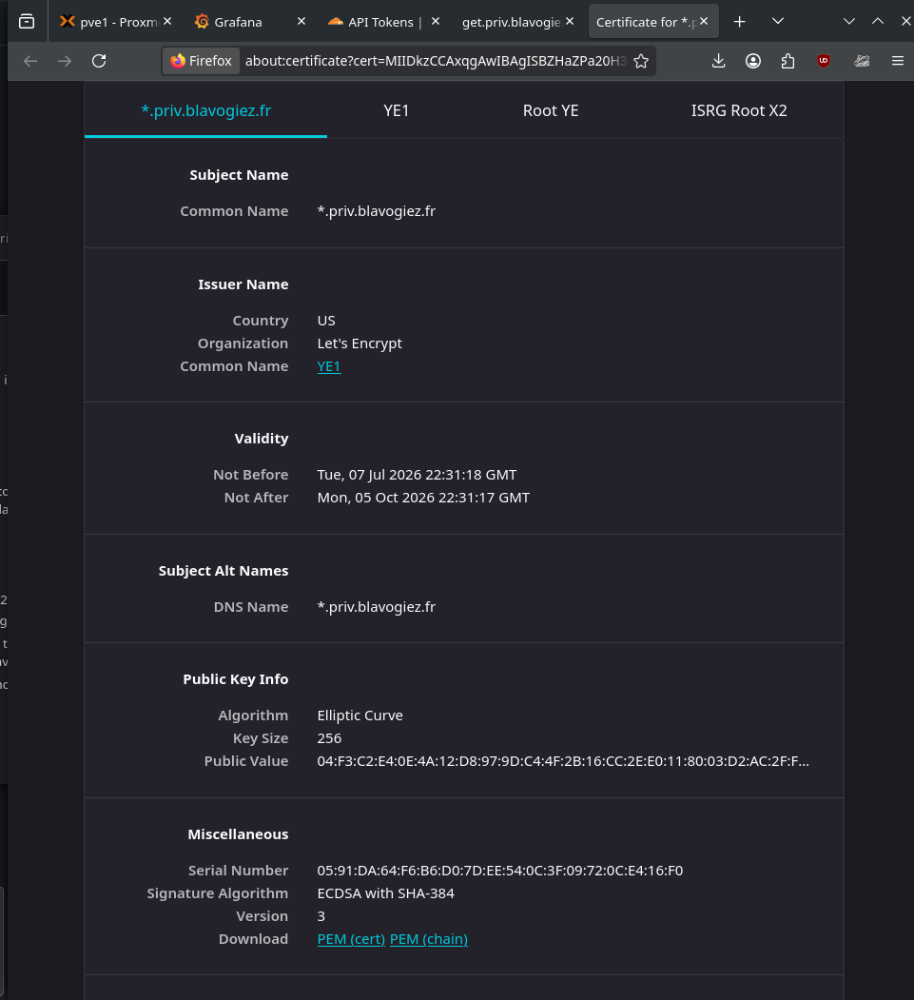

# Routage interne HTTPS avec l'extension Caddy Cloudflare

## Problème

Jusqu'ici le chemin d'une requête type était :
Client -> HTTPS -> Tunnel cloudflare/reverse proxy -> HTTP -> service voulu

Le routage HTTP interne est relativement courant et permet de simplifier, mais dans notre cas, on préfère l'éviter pour être sécurisé au maximum. En effet, si un acteur du PVE / cluster est compromis, alors ces communications internes HTTP pourraient être compromises.

De là, il faut alors faire du HTTPS.

donc l'architecture cible est : 

Client -> HTTPS -> Tunnel cloudflare/reverse proxy -> HTTP**S** -> service voulu

Les navigateurs, pour HTTPS, préfèrent une autorité de certificat de confiance et public (comme Lets encrypt)
Si l'autorité est inconnue / pas publique, il faut accepter le certificat comme "insecure"

Caddy permet cela avec la directive `tls internal` qui donne du HTTPS mais non public, qui est fabriqué et donc interne

Les navigateurs ne vont pas aimer car il n'est pas reconnu, et les outils en ligne de commande nécessitent de passer un flag pour accepter. C'est fonctionnel mais pas vraiment propre pour du long terme

## Solution

Pour cela nous voulons donc du HTTPS interne avec une autorité publique afin que tout le monde puisse y faire confiance et ne doive pas l'accepter spécifiquement.

Or notre infrastructure est isolée et n'a aucune IP publique, alors nous ne pouvons pas utiliser Lets encrypt en mode normal comme Caddy le ferait 

Nous utilisons alors la logique de [DNS cloudflare](https://github.com/caddy-dns/cloudflare), qui sera ici intégré à [l'extension Caddy](../services/caddy/Dockerfile) et qui à l'aide d'un token API va accéder à notre compte pour obtenir des certificats validants.

## Obtenir un token

[Lien](https://dash.cloudflare.com/profile/api-tokens)

(un TTL peut se mettre)

## Au déploiement

Ensuite il faudra le rentrer dans openbao avec [le script](../helper-scripts/create_arbitrary_vault_secrets.sh) au chemin `caddy` et à la clé `CLOUDFLARE_API_TOKEN`

En appelant le playbook universel "deploy any compose" avec l'hote et service Caddy, le playbook va obtenir le secret correspondant au service caddy dans Vault / OpenBao et l'injecter dans le [.env.j2](../services/caddy/.env.j2)

Ce fichier est templaté, copié sur le remote et caddy est relancé

Un site de demo temporaire sur le domaine privé (= pas relié au HTTPS public cloudflare, c'est un sous domaine utilisé dans notre dépôt pour les services réservés à l'infra / vpn) peut aider à voir (comme get.priv.domain, ou monitoring.priv.domain dans notre cas par exemple)

## Résultat

