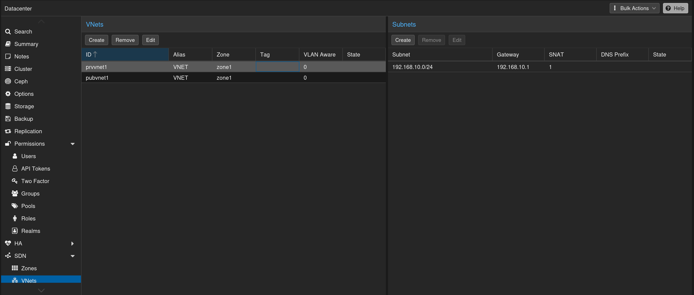
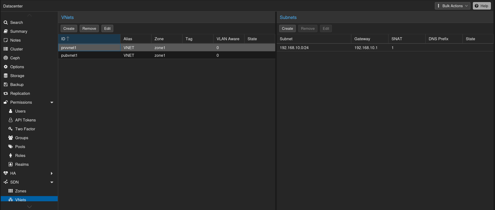
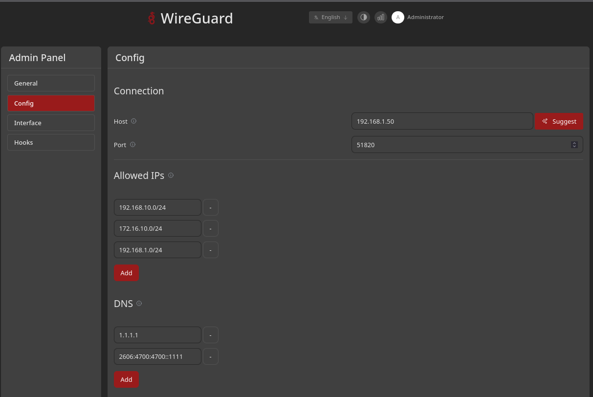
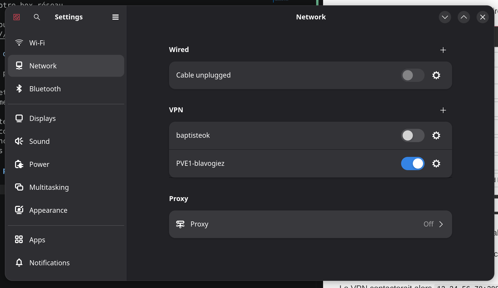

# Infrastructure d'administration du PVE

## 1. Sous-réseaux de machines virtuelles

Ces sous-réseaux seront le coeur des services hébergés sur Proxmox. Ils sont isolés et injoignables par le reste du réseau privé.
Ils sont [décrits dans le dossier terraform](terraform/environments/production/main.tf) sous forme de SDN Proxmox (en gros, un framework/abstraction réseau)





`prvvnet1` désigne tous les services d'administration du PVE (exemple : OpenBao, monitoring Prometheus/Loki/Grafana, Authentik, runners Git...).
`pubvnet1` désigne tous les services qui seront exposés sur internet public (exemple : Kanboard, n'importe quel projet hébergé comme OpenLaTeX).

Lorsque le SDN est créé, il expose des Linux bridge qui sont directement exploitables avec le SNAT configuré (permet au sous-réseau de sortir sur internet en prenant l'adresse de l'hôte proxmox)

Ce sont ces bridges qui une fois associés aux VMs permettent le trafic réseau

Ce découpage en sous-réseau permet de protéger facilement les plages par pare-feu/VPN.

## 2. VPN Wireguard

Une fois les sous-réseaux créés/compris, l'objectif sera d'y avoir accès, depuis n'importe où, de façon sécurisée. 

On utilisera un VPN. on a choisi Wireguard, avec l'implémentation frontend `wg-easy`.

Voir les liens suivants pour l'installation :
- https://wg-easy.github.io/wg-easy/latest/examples/tutorials/basic-installation/
- https://github.com/wg-easy/wg-easy

## Variables utilisées

Dans cette procédure d'installation de Wireguard, les variables suivantes représentent :
- `192.168.1.100` le root PVE central, accessible en réseau domestique
- `192.168.10.0/24` le sous réseau `prvvnet1` (voir terraform)
- `172.16.10.0/24` le sous réseau `pubvnet1` (voir terraform)


## Installation Docker Compose

Pour fluidifier les accès aux sous-réseaux, l'option la plus simple est d'héberger wireguard sur l'hôte Proxmox (`192.168.1.100`). En effet, si l'on mettait Wireguard lui-même sur un sous-réseau (comme `prvvnet1` ), il faudrait beaucoup plus de configuration, et ce serait moins versionnable et plus manuel, ce qui serait contraire à l'objectif de ce dépôt.

Dans le dépôt est décrit une configuration `docker-compose` paramétrée pour les variables décrites ci-dessous.
Cf [Docker compose](../services/wgeasy/docker-compose.yml)


### Création d'un Client

#### Configuration Wireguard

Se rendre sur "http://192.168.1.100:51821", et créer un compte admin.

##### Configuration globale



##### Configuration spécifique


### Accès public

L'objectif est ici d'accéder aux réseaux isolés depuis un PC connecté sur n'importe quel réseau dans le mode.

Puisqu'on est en hébergement "civil", on peut exposer le port 51820 sur l'ip Publique de notre box réseau (Approche sans nom de domaine).

Par exemple pour une Freebox, on peut faire, [après connexion sur le panel admin](https://mafreebox.freebox.fr/#Fbx.os.app.settings.ports.PortRedir) :


L'idée est de pointer l'IP du root PVE central en cible.

Ensuite, on met l'adresse de notre box avec le port, par exemple `12.34.56.78:28820` comme endpoint du VPN.

(On peut également penser à des solutions comme un tunnel Cloudflare sur le PVE + nom de domaine si on veut aller plus loin sans box)

**Attention, il faut uniquement exposer le port 51820 qui est en UDP et aucun autre port, surtout pas le port 51821 qui est l'UI Wireguard. Et de façon plus large, il faut exposer le moins de ports en public.**

### Chaîne finale

Le VPN contacterait alors `12.34.56.78:28820`, qui contacte le root PVE central.

### Connexion par un client

Le client ajoutera son VPN, soit graphiquement, soit par CLI

#### Télécharger la configuration fichier

Du panneau Admin, on télécharge la configuration, puis on la transmet à la personne voulue.
La transmission doit être sécurisée car la configuration contient une clé privée.


#### Soit graphiquement

Ici réalisé sur Debian qui l'intègre nativement, configuration universelle avec Wireguard.




#### Soit en terminal

```bash
nmcli connection import type wireguard file ~/Downloads/PVE1-blavogiez.conf
nmcli connection up PVE1-blavogiez
```

#### Résultat


Nous avons donc accès à tous les sous-réseaux isolés définis dans `Allowed IPs` et depuis n'importe où, de façon sécurisée.
