# gestion du terraform en remote state

## Probleme

Terraform utilise le state, une copie locale de l'état des instances
 
Probleme qu'on a : quand on utilise deux machines les deux states sont desynchronisés. de la on doit le resynchroniser et ca prend du temps

## Solution

Ce qui est propre dans ces cas là c'est un state distant : terraform dit dans sa config qu'il faut stocker (ou aussi où aller le chercher) le state à un endpoint précis. Le state devient alors l'unique source de vérité et puisque tout passe par lui, il sera (sans changements manuels des ressources) toujours synchronisé

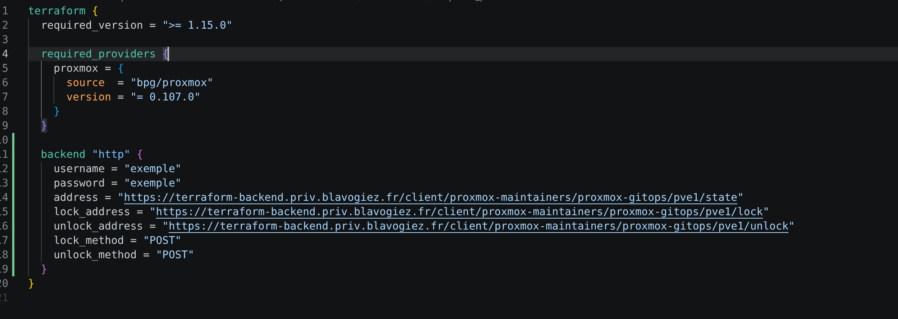

Ce peut être 3 options (que j'ai vu passer, c'est peut etre plus)

- cloud : des solutions comme Terraform Cloud qui propose un plan/apply distant (= point central de secrets) ce qui est très sympa mais peu présent en open source 
- s3 : un object storage complet (mais on a pas besoin de ça, notre besoin se limite à un state terraform)
- http : juste une gestion de state = notre cas , notre besoin

Les points qu'on cherche aussi (et qui ont déterminé notre choix par rapport aux alternatives ):
- Une UI web basique pour avoir une vue d'ensemble
- Open source avec une licence clean et stable pour quelques années (par exemple Minio a retiré l'ui web de sa licence donc on est pas parti sur ça)
- pas prendre une solution plus compliquée que nos besoins (= pas de S3 on a juste besoin de terraform state)

Une solution peu connue mais efficace pour notre besoin, c'est Lynx
[GitHub](https://github.com/Clivern/Lynx/tree/main)
[Déploiement compose](https://github.com/Clivern/Lynx/blob/main/docker-compose.yml)

C'est très basique (et ça a ses limites notamment en usage de mémoire, peut etre à cause de Elixir) mais c'est ce qu'on veut pour aller au plus simple et pas avoir une solution surdimensionnée. 

## Installation

ce sera plutot rapide (juste pas mal de pages, mais en réalité ça prend 1 minute quand on connait)

il y a une config terraform à une VM dédiée pour héberger Lynx. Elle est dans la couche "bootstrap"

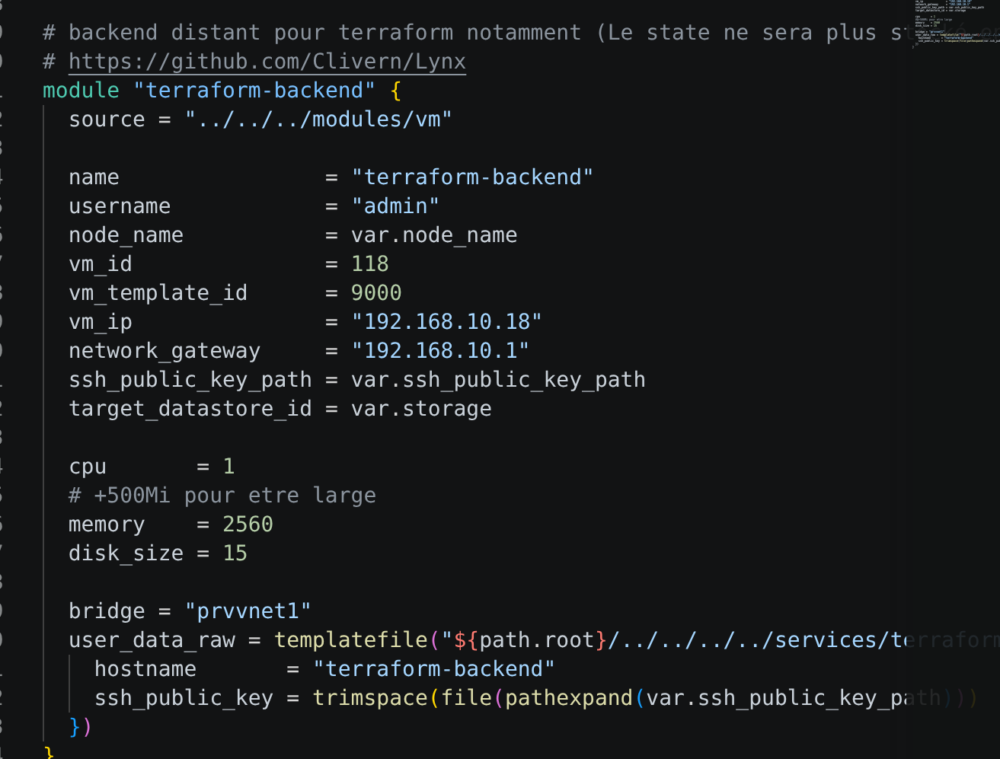

au cloud-init seront générés les secrets internes (PG PASSWORD). Ils ne seront pas utiles, on veut juste qu'ils soient aléatoires c'est tout

Ensuite le déploiement docker compose se fait avec le playbook général comme d'habitude
```bash
blavogiez@debian:~/Documents/Github/proxmox-gitops (42-remote-bac..) $ ./ansible/scripts/deploy_any_compose.sh -e "host=terraform-backend target_service=terraform-backend" -K
```

Le programme tourne alors sur le port 4000

Pour l'accès on a un reverse proxy qui pointe dessus : 

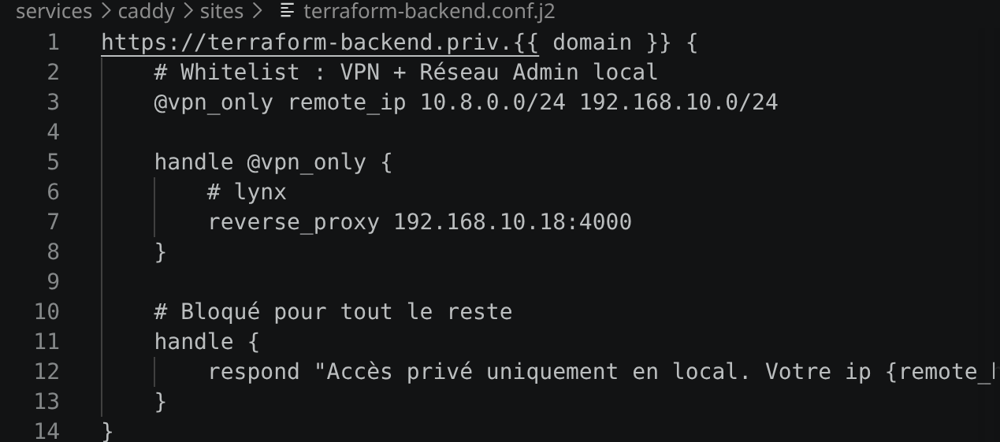

Allez sur 
```
https://terraform-backend.priv.{{ domain }}/install
```

ou bien ce qui est derriere le reverse proxy (ip de la vm:4000)
```
http://192.168.10.18:4000/install
```

Puis la config d'install : 

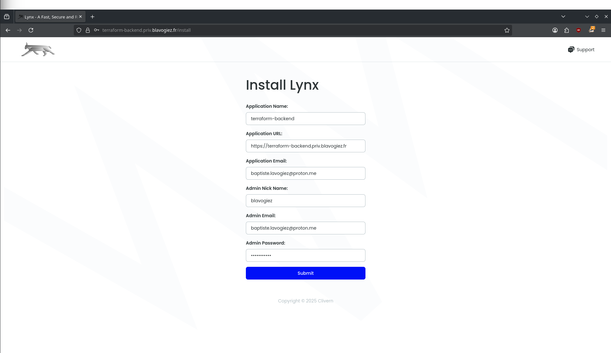

Ensuite on crée un user dédié (pour pas utiliser le compte admin)

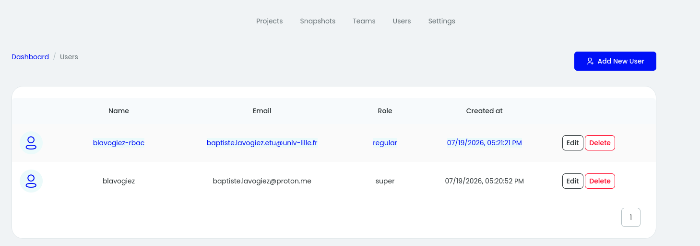

On fait ensuite une "Team" / groupe 

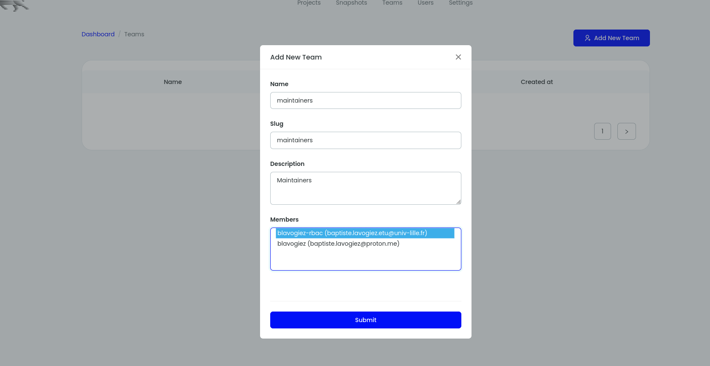

Puis un projet 

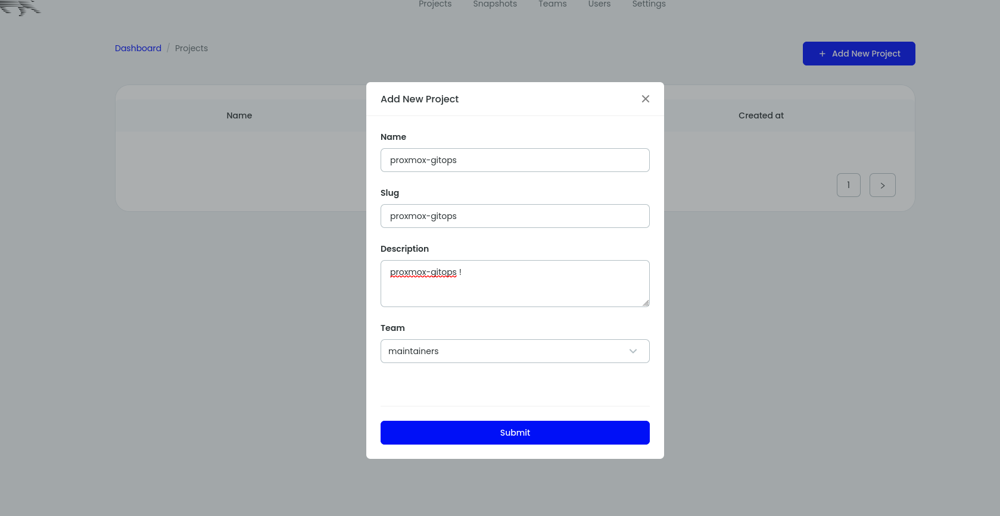

Puis dans "{{ projet }} -> View" on fait un "Environment"

À noter qu'un username et secret générés seront automatiquement proposés

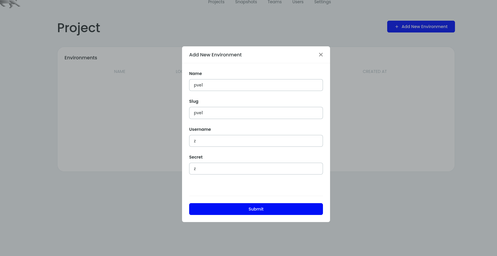

On obtient donc un environnement de projet, qui sera pour nous le point d'accès d'un state 

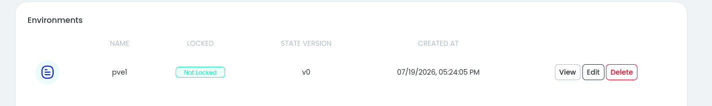

En cliquant sur "View" on obtient alors la config à mettre dans nos fichiers .tf

(fausses infos dans l'image)

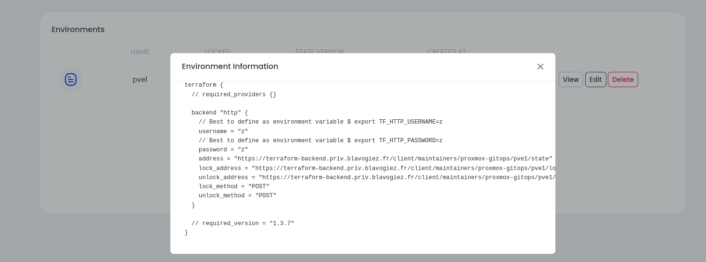

Terraform sait maintenant où diriger son state. Il n'y a plus qu'à tester.

On constatera que le state n'est plus stocké en local mais bien sur Lynx.

On peut même télécharger le state 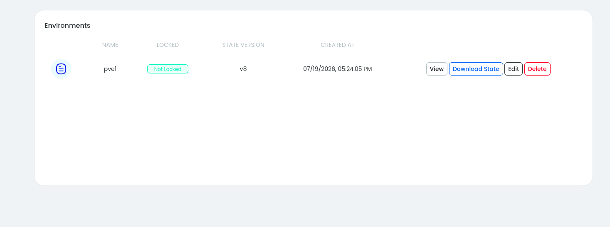
