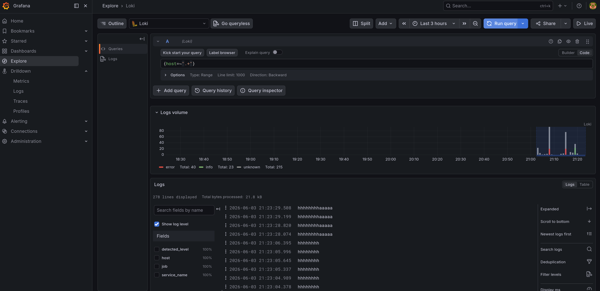

# Monitoring des services

Une VM dédiée contient Prometheus, Grafana, Loki, PVE Prometheus Exporter et Uptime Kuma.
Cette documentation explique comment la configuration est faite et comment diagnostiquer les erreurs possibles.

TODO parler d'import de dashboards

## dashboards utiles

| Scope | Dashboard | Source |
|---|---|---|
| Proxmox / LXC / VM | Proxmox via Prometheus `10347` | `mittelab/proxmox-via-prometheus-dashboard` |
| LXC logs | Custom homelab LXC logs | `this repo` |
| Linux hosts | Node Exporter Full `1860` | `rfmoz/grafana-dashboards` |

## test de la chaîne de logging (Loki/Alloy)

Aller dans Grafana (port 3000)
-> Explore -> Loki


Pour vérifier que tout arrive bien, on fait la requête `{host=~".+"}` qui va montrer toutes les logs lancés par les agents Alloy. (faire bien attention à la plage temporelle de sélection de la requête qui est par défaut à 1H ce qui peut etre en conflit avec le fuseau UTC-2)


Quelques commandes pour voir la source du problème :

```bash
systemctl status alloy
sudo alloy validate /etc/alloy/config.alloy
curl -s http://192.168.10.14:3100/ready
```