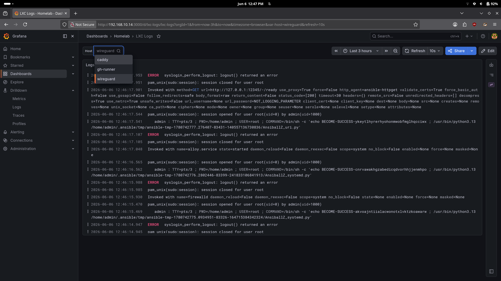

# Monitoring des services

Une VM dédiée contient Prometheus, Grafana, Loki, PVE Prometheus Exporter et Uptime Kuma.
Cette documentation explique comment la configuration est faite et comment diagnostiquer les erreurs possibles.


## dashboards utiles

| Scope | Dashboard | Source |
|---|---|---|
| Proxmox / LXC / VM | Proxmox via Prometheus `10347` | `mittelab/proxmox-via-prometheus-dashboard` |
| LXC logs | Custom homelab LXC logs | `ici` |
| Linux hosts | Node Exporter Full `1860` | `rfmoz/grafana-dashboards` |

## Installation Alloy

[Documentation Grafana Alloy](https://grafana.com/docs/alloy/latest/) 

Le playbook ansible est dans `ansible/playbooks/install_alloy.yml`, avec l'inventaire `ansible/inventories/inventory_alloy.yml`.
Il installe Alloy sur toutes les VMs et envoie la config `services/monitoring/alloy/lxc.alloy` dans `/etc/alloy/config.alloy`.

Pour le lancer :

```bash
cd ansible
./scripts/install_alloy.sh
```

La config actuelle pousse les logs systemd avec `loki.source.journal`, les fichiers `/var/log/*.log`, et les logs Docker avec `loki.source.docker` vers Loki sur `192.168.10.14:3100`.
Elle pousse aussi les métriques Docker/cAdvisor vers Prometheus sur `192.168.10.14:9090` via `prometheus.remote_write`.
Le playbook ajoute l'utilisateur `alloy` aux groupes `systemd-journal`, `adm` et `docker` pour lire le journal, `/var/log` et le socket Docker.
Le `CUSTOM_ARGS` dans le playbook sert à faire écouter Alloy sur `127.0.0.1:12345`, parce que le rôle Grafana vérifie `http://127.0.0.1:12345/-/ready` à la fin.

### Exemples officiels

la config se base sur [cet exemple](https://github.com/grafana/alloy-scenarios/tree/main/docker-monitoring)

et on peut aller plus loin en consultant [d'autres exemples](https://github.com/grafana/alloy-scenarios)


## debug du playbook alloy

Si le playbook fail sur :

```bash
Verify that Alloy URL is responding
Status code was -1 ... Connection refused
```

Ca veut souvent dire que Alloy a crash avant d'ouvrir son endpoint local. Le vrai message est dans les logs du service.

Commandes utiles :

```bash
systemctl status alloy
journalctl -u alloy -n 80 --no-pager
sudo alloy validate /etc/alloy/config.alloy
curl -s http://127.0.0.1:12345/-/ready
curl -s http://192.168.10.14:3100/ready
```

Erreur déjà vue :

```bash
missing ',' in field list
```

Dans ce cas c'etait la config River qui avait des virgules manquantes dans les labels :

```river
labels = {
  job  = "lxc-journal",
  host = constants.hostname,
}
```

[plus d'infos ici](https://grafana.com/docs/agent/latest/flow/concepts/config-language/syntax/)


## test de la chaîne de logging (Loki/Alloy)

Aller dans Grafana (port 3000)
-> Explore -> Loki

Pour vérifier que tout arrive bien, on fait la requête `{host=~".+"}` qui va montrer toutes les logs lancés par les agents Alloy. (faire bien attention à la plage temporelle de sélection de la requête qui est par défaut à 1H ce qui peut etre en conflit avec le fuseau UTC-2)


Quelques commandes pour voir la source du problème :

```bash
systemctl status alloy
sudo alloy validate /etc/alloy/config.alloy
curl -s http://192.168.10.14:3100/ready
```

## Démonstration

Ici, on voit que les logs de chaque machine remontent, après application du playbook d'installation de l'agent Alloy sur toutes les VMs.



